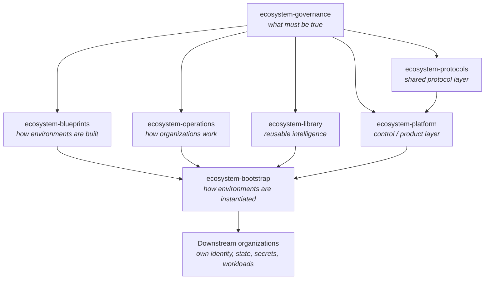

# The At Bryde Ud Ecosystem

Canonical high-level description of the ecosystem: what it is, how it is
divided, and where authority lives. This document is the orientation layer.
Implementation detail lives in the seven project repositories.

---

## 1. At Bryde Ud is the upstream

At Bryde Ud is not a single product organization. It is the **upstream ecosystem**
from which standalone organizations are created, governed, operated, and
continuously improved.

Everything durable — standards, capabilities, modules, workflows, protocols — is
built once here and consumed downstream as versioned baselines. Everything
sensitive — identity, state, secrets, production authority — stays inside the
organization that owns it.

> **Shared code and standards; separate state and authority.**

| Shared upstream | Separate per downstream organization |
|---|---|
| Standards and policy | Identities |
| Baselines and modules | State (remote state, databases) |
| Workflows and SOPs | Secrets |
| Reusable agents, skills, tools | Production authorization |
| Protocols and SDKs | Infrastructure and workloads |
| Reference architecture | Plane instance / workspace |
| | GitHub organization and configuration |
| | Company data |

---

## 2. The seven projects

| Project | The question it answers |
|---|---|
| **Governance** | What must be true. |
| **Operations** | How organizations work. |
| **Blueprints** | How technical environments are built. |
| **Library** | What reusable intelligence capabilities exist. |
| **Bootstrap** | How environments are instantiated. |
| **Platform** | The At Bryde Ud ecosystem control and product layer. |
| **Protocols** | The shared protocol layer. |

### Ownership boundaries

| Project | Owns | Does **not** own |
|---|---|---|
| [`ecosystem-governance`](https://github.com/atbrydeud/ecosystem-governance) | Policy, authority model, security baseline, audit requirements, AI policy, exception policy, change-control requirements, GitHub governance intent, secrets requirements, backup/recovery requirements. | The mechanisms that apply policy; anything that runs. |
| [`ecosystem-bootstrap`](https://github.com/atbrydeud/ecosystem-bootstrap) | Organization declarations, bootstrap workflows, initial Azure/GitHub trust, remote state initialization, application of approved baselines, organization-level integration wiring. | The content of the baselines it applies; long-lived runtime operation. |
| [`ecosystem-blueprints`](https://github.com/atbrydeud/ecosystem-blueprints) | OpenTofu modules, Azure reference architecture, AKS/Kubernetes patterns, networking, zero-trust patterns, workload identity, Argo CD, observability, storage, Postgres/Redis, backups, runtime deployment patterns. | Which organization gets what; policy that mandates a pattern. |
| [`ecosystem-platform`](https://github.com/atbrydeud/ecosystem-platform) | Ecosystem dashboard, organization registry, lifecycle management, Web3 functionality, treasury capabilities, governance functionality, shared APIs/services, cross-organization visibility, provisioning interfaces, approvals, resource/status visibility, protocol integrations. | The protocols themselves; the infrastructure modules it runs on. |
| [`ecosystem-operations`](https://github.com/atbrydeud/ecosystem-operations) | Plane configuration-as-code, project/work-item structures, workflows, SOPs, engineering processes, infrastructure request processes, marketing/content workflows, approvals, release/incident processes, Definitions of Done, templates, operational lifecycle patterns. | What is mandatory (that is governance); technical implementation. |
| [`ecosystem-library`](https://github.com/atbrydeud/ecosystem-library) | Eve agents, reusable agents, skills, tools, MCP servers/connectors, reusable instructions, agent templates, evals, shared context conventions, automation components, tool permission profiles. | AI policy (that is governance); product surfaces. |
| [`ecosystem-protocols`](https://github.com/atbrydeud/ecosystem-protocols) | Protocol specifications, contracts, SDKs, shared primitives, governance mechanics, token/protocol mechanics, interoperability rules, reference implementations, versioning/compatibility. | Product integration of the protocols (that is platform). |

The single most useful distinction:

- **Governance** says a thing *must* be true.
- **Blueprints** define *how* it is built.
- **Bootstrap** *instantiates* it.
- **Operations** defines *how people and agents work* around it.
- **Library** provides the *reusable intelligence* that does the work.
- **Platform** provides the *control surface* over all of it.
- **Protocols** define the *shared contracts* between participants.

Need to place a specific change? See [PROJECT_MAP.md](PROJECT_MAP.md).

---

## 3. Git is the source of truth

Ecosystem configuration is expressed as code and reviewed as code. Any state
that defines how the ecosystem or a downstream organization is configured must
be reconstructible from Git.

- Configuration lives in a repository, not only in a console.
- Change happens through pull requests with review and audit trail.
- Drift between declared and actual state is detectable and correctable.
- SaaS systems are configured *from* Git wherever the system supports it.

SaaS is acceptable — and often correct — where it provides real leverage. What
is not acceptable is a SaaS tenant becoming the only place where the shape of
the ecosystem is recorded.

---

## 4. AI-first

The ecosystem assumes agents are first-class participants, not an afterthought.

- Repositories are written to be usable as orientation context by agents.
- Reusable agents, skills, tools and MCP servers are shared capabilities in
  [`ecosystem-library`](https://github.com/atbrydeud/ecosystem-library), versioned like any other component.
- AI policy — what agents may do, with which authority, under which review — is
  owned by [`ecosystem-governance`](https://github.com/atbrydeud/ecosystem-governance).
- AI-assisted contribution is expected and allowed. Accountability for a change
  always rests with the human or team that submits it.

---

## 5. Policy vs. operations vs. blueprints

These three are routinely confused. They are not the same thing.

| | Governance | Operations | Blueprints |
|---|---|---|---|
| Question | What must be true? | How do we work? | How is it built? |
| Artifact | Policy, baseline, requirement | Workflow, SOP, template, DoD | Module, pattern, reference architecture |
| Changes because | Risk, obligation, authority changed | The way work flows changed | The technical approach changed |
| Binding? | Yes — normative | Yes — procedural | No — it implements requirements |

A rule that says "all clusters must have private control planes" is governance.
The OpenTofu module that builds a private control plane is a blueprint. The
process for requesting a cluster is operations.

---

## 6. SaaS vs. self-hosted

Neither is a default virtue. The decision is made on ownership and portability:

- **Use SaaS** when it provides leverage disproportionate to its cost and the
  data or configuration it holds can be reproduced from Git.
- **Prefer open source or self-hosting** when ownership, portability or
  sovereignty of the data or capability justifies the operational cost.
- **Never** let a SaaS tenant become the sole definition of the ecosystem.
- Every SaaS dependency should have a known answer to "what happens if we lose
  it tomorrow?"

---

## 7. Versioned baselines

Downstream organizations do not track the upstream `main` branch. They consume
**versioned baselines**: a named, reviewable set of standards, modules and
configurations known to work together.

- Baselines are versioned and released, not continuously mutated.
- A downstream organization records which baseline version it is on.
- Upgrading a baseline is an explicit, reviewable change with a migration path.
- Policy changes that require downstream action carry a version bump and a
  stated migration expectation. See the governance change issue template.

---

## 8. Bootstrap philosophy

Creating a standalone organization should be a declarative, repeatable act, not
an artisanal one.

1. Declare the organization (its name, purpose, environments, entitlements).
2. Establish trust: identity and OIDC/workload-identity federation to Azure and GitHub.
3. Initialize state: remote state, secrets backing, backup targets.
4. Apply the approved baseline at the recorded version.
5. Wire organization-level integrations.
6. Hand over authority to the organization.

After bootstrap the organization is **independently operable**. Failure of the
upstream control plane must not cause downstream production failure.

---

## 9. The downstream organization model

A downstream organization is a real, standalone organization — its own GitHub
organization, its own cloud identity, its own state, secrets, data and
production authority. It inherits standards; it does not inherit access.

| Relationship | Direction |
|---|---|
| Standards, baselines, modules, protocols | Upstream → downstream |
| Improvements, patterns, findings | Downstream → upstream (via PR to the owning project) |
| Production authority | Never leaves the downstream organization |
| Secrets and state | Never leave the downstream organization |

Improvements found while operating a downstream organization are contributed
back to the project that owns that concern, rather than forked locally — that
is what keeps the ecosystem coherent.

---

## Related documents

- [PROJECT_MAP.md](PROJECT_MAP.md) — which repo owns a given change
- [ARCHITECTURE_PRINCIPLES.md](ARCHITECTURE_PRINCIPLES.md) — the principles behind this model
- [GETTING_STARTED.md](GETTING_STARTED.md) — orientation for contributors and agents
- [../GOVERNANCE.md](../GOVERNANCE.md) — how governance changes are proposed
